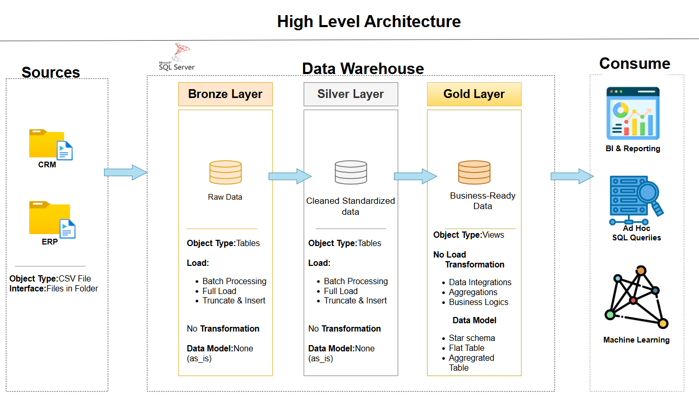

# Data Warehouse & Analytics Project

**A Modern Data Engineering & Analytics Solution**

  
  


---

## Overview

End-to-end data pipeline implementing industry best practices for:
- **Data Warehousing** (Medallion Architecture)
- **ETL/ELT Processes**
- **Dimensional Modeling** (Star Schema)
- **Analytics & Reporting**

---

## Architecture

### Medallion Data Layers

| Layer  | Purpose                  | Key Features                     |
|--------|--------------------------|----------------------------------|
| Bronze | Raw data ingestion       | Preserves source fidelity       |
| Silver | Cleansed & validated data| Data quality checks             |
| Gold   | Analytics-ready models   | Star schema optimization        |



---

## Implementation

### Core Components
- **Data Sources**: ERP & CRM systems (CSV)
- **Database**: SQL Server
- **ETL**: SQL-based transformations
- **Analytics**: SQL reports + Tableau dashboard

### Key Features
- Automated data ingestion pipeline
- Data validation & cleansing
- Slowly Changing Dimensions (Type 1)
- Star schema dimensional model
- Business performance dashboards

---

## Repository Structure
```
data-warehouse-project/
│
├── datasets/                           # Raw datasets used for the project (ERP and CRM data)
│
├── docs/                               # Project documentation and architecture details
│   ├── etl.drawio                      # Draw.io file shows all different techniquies and methods of ETL
│   ├── data_architecture.drawio        # Draw.io file shows the project's architecture
│   ├── data_catalog.md                 # Catalog of datasets, including field descriptions and metadata
│   ├── data_flow.drawio                # Draw.io file for the data flow diagram
│   ├── data_models.drawio              # Draw.io file for data models (star schema)
│   ├── naming-conventions.md           # Consistent naming guidelines for tables, columns, and files
│
├── scripts/                            # SQL scripts for ETL and transformations
│   ├── bronze/                         # Scripts for extracting and loading raw data
│   ├── silver/                         # Scripts for cleaning and transforming data
│   ├── gold/                           # Scripts for creating analytical models
│
├── tests/                              # Test scripts and quality files
│
├── README.md                           # Project overview and instructions
├── LICENSE                             # License information for the repository
├── .gitignore                          # Files and directories to be ignored by Git
└── requirements.txt                    # Dependencies and requirements for the project
```
---

## Sample Output

[](https://public.tableau.com/app/profile/brian.siele/viz/SalesandCustomerDashboard_17505889969040/SalesDashboard)

---

## Tools
- **Database**: SQL Server
- **ETL**: T-SQL
- **Visualization**: Tableau
- **Diagramming**: Draw.io
- **Version Control**: Git/GitHub

---

## License
MIT License - See [LICENSE](LICENSE) for details.

---

## Author
**Brian Kimutai**  
Data Engineer & Analyst  

[](https://www.linkedin.com/in/brian-kimutai-0888352b6/)  
[](https://kimutai99.github.io/briankimutai.github.io/)
